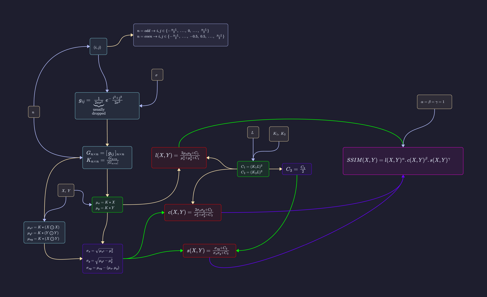

# SSIM
**SSIM** (Structural Similarity Index) is a widely used full-reference ***Image Quality Assessment (IQA)*** metric designed to measure the perceived quality of digital images and videos.
# What It Actually Does

Unlike traditional error-sum metrics like MSE (Mean Squared Error) or PSNR (Peak Signal-to-Noise Ratio), which evaluate image degradation purely on absolute pixel-by-pixel differences, SSIM models image degradation as perceived change in **structural information**.

It evaluates perceptual quality by comparing three key visual components between a reference image ($X$) and a test/distorted image ($Y$) using a sliding window approach:

1. ***Luminance ( $l$ )*** ➔ Compares the local mean brightness of the two images.

2. ***Contrast ( $c$ )*** ➔ Compares the local standard deviations (variances), reflecting the contrast levels.

3. ***Structure ( $s$ )*** ➔ Compares the normalized covariance of the two images to see if the structural patterns and spatial arrangements of objects match.
# Calculation Method Flow Chart

## Formula
$$\huge{SSIM(X,Y)=l(X,Y).c(X,Y).s(X,Y)}$$
### 2-D Gaussian Function / Gaussian Kernel
$$\huge{G(x,y)={\frac{1}{2\pi \sigma^2}}e^-{\frac{x^2+y^2}{2\sigma^2}}}$$
### Terminologies
- $l(X,Y)$ ➔ **Luminance**.

- $c(X,Y)$ ➔ **Contrast**.

- $s(X,Y)$ ➔ **Structure**.

- $\sigma$ ➔ *Standard Deviation of the local Gaussian weighting window* ( Usually optimized to $0.8$ ).

- $X,Y$ ➔ *Image Matrices*.

- $K$ ➔ *Kernel Matrix*.

- $n$ ➔ *Dimension* of Kernel Matrix.

- $L$ ➔ *Dynamic Range* of pixel values ( $2^8-1=255$ for $8$-bit images ).

- $K_1,K_2$ ➔ *Small Scalar Constants* ( $K_1=0.01,\hspace{0.15cm}K_2=0.03$ ).

- $C_1,C_2,C_3$ ➔ *Stabilization Constants*.

- $\mu_x,\mu_y$ ➔ *Local Mean Intensities* of image $x$ & image $y$.

- $\sigma_x^2,\sigma_y^2$ ➔ *Local Variance* of image $x$ & image $y$.

- $\sigma_{xy}$ ➔ *Local Convergence* between image $x$ & image $y$.
