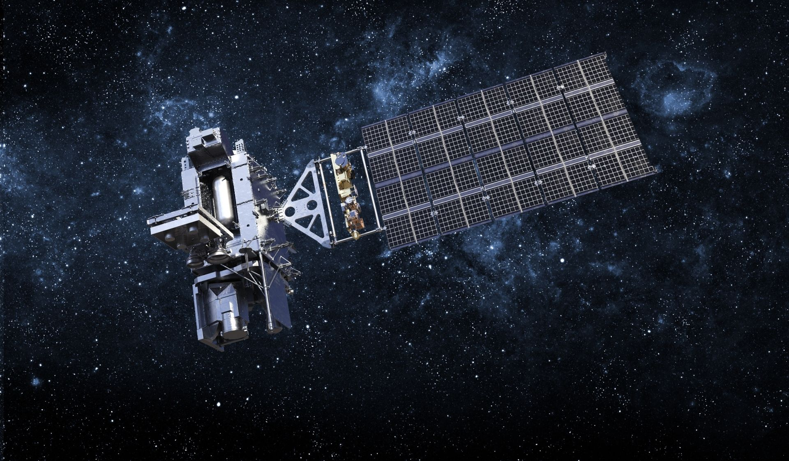

# Enhancing Temporal Resolution of Satellite Imagery using Motion Interpolation
---
## Introduction
---
Satellite images from geostationary satellites are often captured at fixed intervals (e.g., every 30 minutes for INSAT, or every 10 minutes for Himawari/GOES). This restricts near real-time monitoring of dynamic and fast-moving phenomena such as cyclones, thunderstorms, floods, and rapid land changes. Traditional optical-flow temporal interpolation methods are limited, often yielding incorrect results like blurred images and artifacts, failing to capture non-linear cloud dynamics. 



This project develops and uses an AI/ML-based Optical Flow frame interpolation technique to generate synthetic intermediate frames between consecutive satellite images. This effectively enhances temporal resolution (e.g., from 10 minutes to 5 or 2.5 minutes), enabling more frequent observations without requiring additional satellite resources.
## Dataset Links
---
### GOES-19 ABI Channel 13 data from NOAA GOES-19 AWS bucket
- [NOAA-GOES-19 Link](https://noaa-goes19.s3.amazonaws.com/index.html)

- [NOAA-GOES-19 ABI-L1b-RadF Link](https://noaa-goes19.s3.amazonaws.com/index.html#ABI-L1b-RadF/)
### INSAT-3DS/3DR TIR1 channel data from MOSDAC
- [INSAT-3DR Link](https://mosdac.gov.in/catalog-app/satellite?mission=INSAT-3DR)

- [INSAT-3DS Link](https://mosdac.gov.in/catalog-app/satellite?mission=INSAT-3DS)
## Dataset Used
---
This project utilizes satellite imagery obtained from the ***NOAA GOES-19*** AWS bucket ([NOAA-GOES-19 ABI-L1b-RadF](https://noaa-goes19.s3.amazonaws.com/index.html#ABI-L1b-RadF/)). The data utilized includes: 
### File Nomenclature
  The data files follow a highly structured naming convention, which enables efficient programmatic filtering and retrieval.

**Example Filename :**

`OR_ABI-L1b-RadF-M6C13_G19_s20221311900320_e20221311903397_c20221311903433.nc`
<br>

|   **Component**    | **Description**                                              |
| :----------------: | :----------------------------------------------------------- |
|      ***OR***      | Data classification: Operational                             |
| ***ABI-L1b-RadF*** | Instrument & Product Level <br>(ABI L1b Radiance, Full Disk) |
|    ***M6C13***     | Mode 6, Channel 13                                           |
|     ***G19***      | Satellite: GOES-19                                           |
| ***s[timestamp]*** | Start time (YYYYDDDHHMMSS)                                   |
| ***e[timestamp]*** | End time                                                     |
| ***c[timestamp]*** | File creation time                                           |
<br>

### Channels Used in This Project
* **True-Color RGB Composition** → Constructed using Channels 1, 2, and 3: 
<br>

| **Channels** | **Specification**             |
| ------------ | ----------------------------- |
| Channel 1    | Contains *Blue* composition.  |
| Channel 2    | Contains *Red* composition.   |
| Channel 3    | Contains *Green* composition. |
<br>

* **Thermal Imaging** → Derived from *Channel 13*, which actually contains ***Thermal Infrared band data*** (~10 $\mu m$).
<br>

## Results of Project
---
#### Moving Car

| [Original](https://github.com/yashb3385/Data_Samples/raw/refs/heads/main/moving_car/video/10fps.mp4)<br> | [4X Interpolation](https://github.com/yashb3385/Data_Samples/raw/refs/heads/main/moving_car/video/final_4X_40fps.mp4)<br> |
| :---------------------------------------------------------------------------------------------------------------------------------------------------------------------------------------------------: | :-----------------------------------------------------------------------------------------------------------------------------------------------------------------------------------------------------------------------------: |

#### Heatmap Composition

| [Original](https://github.com/yashb3385/Data_Samples/raw/refs/heads/main/GOES-19_Interpolation_Result/C13_Heatmap/original_C13_3fps_s20250010000_e20250021150.mp4)<br> | [8X Interpolation](https://github.com/yashb3385/Data_Samples/raw/refs/heads/main/GOES-19_Interpolation_Result/C13_Heatmap/final_C13_8X_24fps_s20250010000_e20250021150.mp4)<br> |
| :---------------------------------------------------------------------------------------------------------------------------------------------------------------------------------------------------------------------------------------------------------------------------------------------------------------------------------------: | :-----------------------------------------------------------------------------------------------------------------------------------------------------------------------------------------------------------------------------------------------------------------------------------------------------------------------------------------: |

#### RGB Composition

| [Original](https://github.com/yashb3385/Data_Samples/raw/refs/heads/main/GOES-19_Interpolation_Result/RGB/original_RGB_2fps_s20250010000_e20250012350.mp4)<br> | [8X Interpolation](https://github.com/yashb3385/Data_Samples/raw/refs/heads/main/GOES-19_Interpolation_Result/RGB/final_RGB_8X_16fps_s20250010000_e20250012350.mp4)<br> |
| :------------------------------------------------------------------------------------------------------------------------------------------------------------------------------------------------------------------------------------------------------------------------------------------------------: | :----------------------------------------------------------------------------------------------------------------------------------------------------------------------------------------------------------------------------------------------------------------------------------------------------------------: |
#### ERROR BENCHMARK : TRUE VS PREDICTED SATELLITE FRAME

```bash
===========================================================
             SATELLITE NETCDF ERROR DASHBOARD        
            (Time : 20250010120, Channel : 13)     
===========================================================
      Mean Squared Error    (MSE)    :   0.004341
      Peak Signal-to-Noise  (PSNR)   :   23.62 dB
      Structural Sim        (SSIM)   :   0.9703
      Feature Similarity    (FSIM)   :   0.9837
===========================================================
```
## 📂 Repository Usage Guide
---
*   **Execution Order** → All Python scripts are prefixed with a number (e.g., `1.xyz.py`, `2.xyz.py`). It will be preferable to execute them in ascending numerical order.
<br>

*   **Utility Scripts** → Every folder contains a `download.py` and a `delete.py` (specifically input folders) to manage fetching necessary input data and cleaning up outputs.
## 📂 Repository Structure
---
### 1.rgb_images
Contains scripts to download GOES-19 channels 1, 2, and 3 data. It includes code to extract the raw data from `.nc` files and compile them into true-color RGB images.

### 2.heatmap
Contains scripts dedicated to downloading and processing GOES-19 Channel 13 data. It extracts the thermal data and generates grayscale or `RdYlBu_r` heatmap images of the Earth.

### 3.intermediate_frame_using_average
This section documents early experiments exploring mathematical averaging as a baseline for frame interpolation, which ultimately proves why Deep Learning is necessary.

*   **`1.average`** → Creates an intermediate image by averaging two C13 `.nc` files (e.g., 20:00 and 20:20). Comparing this average to the *actual* 20:10 real `.nc` file proved that simple averaging creates a messy, overlapping "**double vision**" effect rather than capturing true fluid motion.

*   **`2.average_can_be_bad`** → Contains real-world examples (`sample1` with displacing static tables, `sample2` with a moving car) demonstrating the severe visual artifacts caused by standard averaging.

*   **`3.average_on_video`** → Applies averaging to a video of a moving car, showing that inserting averaged intermediate frames severely degrades video quality by **overlapping double vision frames**.

>***Note*** → The above folders are provided for **educational purposes** only and have no functional connection to the actual deep learning interpolation model (*4.RIFE-Deep_Learning_Model*).
## Deep Learning Interpolation (4.RIFE-Deep_Learning_Model)
---
This directory contains the core solution of the project : the prebuilt [**ECCV2022-RIFE**](https://github.com/hzwer/ECCV2022-RIFE) deep learning model developed by [hzwer](https://github.com/hzwer). RIFE (***Real-Time Intermediate Flow Estimation***) accurately calculates optical flow to synthesize completely new, physically plausible frames between satellite captures. Here is Step-by-Step Execution:
### 1. Setup and Installation
Execute **1.install_requirements.py** after cloning the repository to download and install all necessary dependencies, weights, and libraries for the RIFE model. 
<br>

```bash
git clone https://github.com/yashb3385/RIFE_Motion_Interpolation_on_GOES-19_Data.git
cd RIFE_Motion_Interpolation_on_GOES-19_Data/4.RIFE-Deep_Learning_Model
python 1.install_requirements.py
```
<br>

>**Note** → This installation is heavy and will consume approximately ***10 GB*** of disk space. This will install ***Python 3.10*** as a virtual environment all heavy packages will be installed for Python 3.10.
### 2. Preparing the Input Data
Before running the model, you must place your data into the input directories located at `1.input/input1`, `1.input/input2`, etc. The RIFE model pipeline is highly versatile and accepts:

*   Standard image frames in ordered numerical names (`000.png, 001.png, 002.png, etc.`)
*   Video files (`.mp4`)
*   Raw satellite data (`.nc` files) in their respective channel folders.

> ***Note*** → All input folders contain `1.download.py` and `2.delete.py` to download sample input data except `1.input/input4` as it contains scripts `1.download.py` and `2.delete.py` to download and clean **actual GOES-19 data**.
<br>

**Handling `.nc` Files :**

- You can place raw `.nc` files inside their respective `C{i}` Channel Folders (e.g.`C01, C03, C13,etc.`) within the input directories. 

- For convenience, you can *automatically download* required `.nc` files directly into `1.input/input4` using the included `1.download.py` utility.

- **`2.delete.py`** → Safely deletes the all channel folders where your `.nc` files in your input directory. This file must be placed in the input directory. You can find it in `1.input/input4`.
### 3. Executing the Interpolation Model
Once your inputs are staged, run:
```bash
python 2.executer.py
```
### 4. Managing Storage & Cleanup
Because satellite data and model dependencies take up significant space, robust cleanup tools are provided:

- **`2.delete.py`** → Safely deletes the all channel folders where your `.nc` files in your input directory. This file must be placed in the input directory. You can find it in `1.input/input4`.

- **`3.delete_output.py`** → Interactively clears generated experiment results. When executed, this script provides custom prompts allowing you to selectively delete `img_output` folders (including any associated `Native` directories), `video_output` folders, or both. This enables you to preserve specific results while clearing unnecessary files.

- **`4.delete_requirements.py`** → Completely uninstalls all requirements and model dependencies (***reclaiming ~10 GB of storage***) when you are finished working.
  
```bash
python 4.delete_requirements.py
```

> ***Note*** → Don't worry about executing this file, this won't delete anything from your main python. Only **Python 3.10** will be deleted alongside its **packages**.
## 📊 Error Analysis & Model Evaluation (5.Error_Analysis_RIFE)
---
This module provides a scientific framework to evaluate RIFE motion interpolation against real GOES-19 satellite ground truth data. It safely processes large telemetry matrices to compute spatial and structural metrics.
### Evaluation Metrics
The pipeline benchmarks the generated intermediate frame using four core metrics:
<br>

*   [**Mean Squared Error (MSE)**](https://github.com/yashb3385/RIFE_Motion_Interpolation_on_GOES-19_Data/blob/main/5.Error_Analysis_RIFE/utils/Error%20Matrices/MSE%20%26%20PSNR.md) → Tracks average squared variance of radiance values.
<br>

*   [**Peak Signal-to-Noise Ratio (PSNR)**](https://github.com/yashb3385/RIFE_Motion_Interpolation_on_GOES-19_Data/blob/main/5.Error_Analysis_RIFE/utils/Error%20Matrices/MSE%20%26%20PSNR.md) → Measures signal degradation and artifact levels in dB.
<br>

*   [**Structural Similarity Index (SSIM)**](https://github.com/yashb3385/RIFE_Motion_Interpolation_on_GOES-19_Data/blob/main/5.Error_Analysis_RIFE/utils/Error%20Matrices/SSIM.md) → Evaluates spatial textures and cloud boundaries.
<br>

*   [**Feature Similarity Index (FSIM)**](https://github.com/yashb3385/RIFE_Motion_Interpolation_on_GOES-19_Data/blob/main/5.Error_Analysis_RIFE/utils/Error%20Matrices/FSIM.md) → A custom Python-optimized implementation tracking high-frequency edge retention.
### Step-by-Step Workflow
Run these scripts sequentially within the `5.Error_Analysis_RIFE` folder:
#### 1. Download Test Frames :
```bash
python 1.download.py
```

_Downloads two consecutive `.nc` frames into `/input` and their true mid-point intermediate `.nc` file into `/intermediate`._
#### 2. Generate AI Prediction :
```bash
python 2.intermediate_will.py
```
 
 _Runs RIFE's optical-flow tracking to generate the predicted midpoint frame._
#### 3. Compute Metrics & Error Plots :
```bash
python 3.compare.py
```

_Prints the validation dashboard to the console and exports a diagnostic error map (`C{i:02d}_error_analysis.png`)._
#### 4. Directory Cleanup :
```bash
python 3.delete_input_intermediate.py
```

*Safely clears all processed and raw `.nc` matrix files from the active working directories.*